<h1 align="center">Hi 👋, I'm AzurTian</h1>
<h3 align="center">☕ Java / 🐍 Python developer, obsessed with design patterns and code elegance</h3>
<h3 align="center">🏴‍☠️ Luffy fan, looking for real friends to chase our One Piece together</h3>
<h3 align="center">💙 Blue is my favorite color — blue means “because love u everyday”.</h3>

  

- 🌱 I’m currently learning **AI agent**

- 👨‍💻 All of my projects are available at [AzurTian](https://github.com/AzurTian?tab=repositories)

- 📝 I regularly write articles on [azurtian blog](https://azurtian.github.io/azurtian/)

- 💬 Ask me about **java, python, automation tools**

- 📫 How to reach me **azurtian@qq.com**

<h3 align="left">Languages and Tools:</h3>

  
  
  
  
  
  
  
  
  
  
  
  
  
  
   

